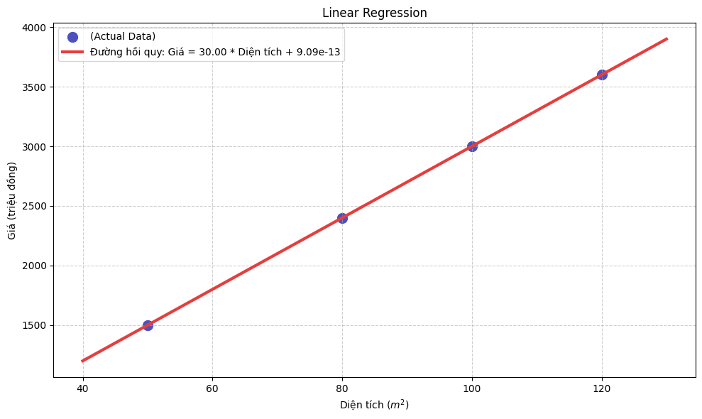

# Linear Regression

## **1. Linear Regression**

### **1.1. Introduction**

Linear regression là một thuật toán học có giám sát trong machine learning, nơi thể hiện mối quan hệ giữa các biến độc lập và biến phụ thuộc. Nó giả định rằng mối quan hệ của biến độc lập và biến phụ thuộc là tuyến tính. Cụ thể, phương pháp này sẽ học từ tập dữ liệu đã được gắn nhãn và ánh xạ các điểm dữ liệu thành một hàm tuyến tính được tối ưu hóa có thể sử dụng để dự đoán trên tập dữ liệu mới.

Phương trình tổng quát của linear regression:
$y \approx \hat{y} = w_0 + w_1x_1 + w_2x_2 + \dots + w_nx_n$

trong đó:

- **$y$**: giá trị thực của đầu ra (ground truth)

- **$\hat y$**: biến phụ thuộc (giá trị đầu ra dự đoán - predict output)

- **$x_1, x_2, \dots, x_n$**: các biến độc lập

- **$w_0, w_1, \dots, w_n$**: các hệ số cần tìm

Mục tiêu của Linear regression là ước tính các hệ số $w$ để giảm thiểu sai số dự đoán cho biến phụ thuộc - $\hat y$ dựa trên tập hợp các biến độc lập - $x$. Để thực hiện điều này, một cách hiểu đơn giản là cố gắng tìm một phương trình tuyến tính để cho $\hat y$ xấp xỉ với giá trị $y$. Mặc dù, $y$ và $\hat y$ là hai giá trị khác nhau do sai số của mô hình; tuy nhiên chúng ta mong muốn sự khác nhau giữa hai giá trị là nhỏ nhất.

---

### **1.2. Hàm mất mát cho linear regression**

Như đã thảo luận trước đó, việc tìm ra một phương trình tuyến tính cho các trường hợp thực tế là không dễ dàng vì quá trình tính toán sẽ phát sinh lỗi. Những lỗi này cần được tính toán để giảm thiểu chúng. Sự khác biệt giữa giá trị dự đoán $\hat y$ và giá trị thực $y$ được gọi là hàm mất mát.

Hàm mất mát được hình thành từ việc lấy giá trị dự đoán $\hat y$ và so sánh nó với giá trị mục tiêu (target) $y$ bằng phép tính $(\hat y - y)$ để đo lường khoảng cách giữa giá trị dự đoán và giá trị mục tiêu.

➡️-> Chúng ta muốn tìm các giá trị $w$ để sai số $(\hat y-y)$ là nhỏ nhất.

Ở đây, phép tính $(\hat y-y)$ đôi khi là số âm nên ta có thể tính toán bằng cách lấy giá trị tuyệt đối $|\hat y-y|$ hoặc lấy bình phương $(\hat y-y)^2$. Trong linear regression, cách lấy giá trị tuyệt đối ít được sử dụng hơn vì hàm này không khả vi tại mọi điểm, sẽ không thuận tiện cho việc tối ưu sau này.

Chính vì vậy, **MSE - Mean Squared Error** được sử dụng để tính toán giá trị trung bình của các sai số bình phương giữa giá trị dự đoán và giá trị thực.

Hàm MSE có thể được tính như sau:

$$J = \frac{1}{n}\sum_{i=1}^{n}(\hat y_i - y_i)^2$$

Bài toán lúc này chuyển thành tìm các giá trị $w$ để giá trị hàm mất mát $J$ là nhỏ nhất.

---

### **1.3. Tóm tắt**

- Linear regression mong muốn có một đường thẳng phù hợp cho bộ dữ liệu huấn luyện với phương trình: $y = w_0 + w_ix_i$

- **Tham số**: $w$

- Tùy vào cách chọn các tham số $w$ ta sẽ có được các đường thẳng khác nhau.

- **Mục tiêu**: Cần tìm $w$ sao cho đường thẳng phù hợp nhất với bộ dữ liệu huấn luyện.

- Để đo mức độ lựa chọn $w$ phù hợp, ta có **hàm mất mát (Loss Function)**.

- **Hàm mất mát**: Hàm này đo lường sai số giữa các dự đoán của mô hình và giá trị thực tế.

  $$J = \frac{1}{n}\sum_{i=1}^{n}(\hat y_i - y_i)^2$$
- **Mục tiêu cuối cùng**: Tìm các giá trị $w$ để hàm mất mát $J$ là nhỏ nhất.

  $$w = \text{minimize}_w J(w)$$

---

## **2. Gradient Descent**

### **2.1. Gradient descent là gì?**

Gradient descent (GD) là một kỹ thuật tối ưu phổ biến, thường được dùng để huấn luyện các mô hình học máy và mạng nơ-ron. Nó giúp huấn luyện các mô hình bằng cách giảm thiểu sai số giữa kết quả dự đoán và kết quả thực tế.

Trong linear regression, kỹ thuật này giúp chúng ta đi tìm điểm tối ưu trên hàm mất mát, nơi mà sai số dự đoán được giảm thiểu tối đa. Như vậy, có thể nói hàm mất mát đóng vai trò như một thước đo; còn Gradient descent là công cụ để tìm ra tham số tối ưu nhất cho hàm mất mát.

---

### **2.2. Cách hoạt động**

Gradient descent hoạt động bằng cách bắt đầu với các tham số mô hình ngẫu nhiên và liên tục điều chỉnh chúng để làm giảm sự khác biệt giữa giá trị dự đoán và giá trị thực tế.

Với GD, việc cần làm là tiếp tục thay đổi các tham số $w$ mỗi lần một chút để cố gắng giảm giá trị hàm mất mát $J(w)$ cho đến khi $J$ ổn định hoặc gần mức tối thiểu.

**Công thức cập nhật:**

$$w = w - \alpha \cdot \nabla J(w)$$

Trong đó:

- **$w$**: là trọng số tối ưu cần tìm

- **$\alpha$ (alpha)**: learning rate - là tốc độ học, xác định độ lớn của mỗi bước cập nhật.

- **$\nabla J(w)$**: đạo hàm riêng của hàm mất mát theo từng tham số.

Learning rate thường là số nhỏ giữa 0 và 1, về cơ bản $\alpha$ kiểm soát độ lớn bước di chuyển của trọng số. Đạo hàm giúp xác định được hướng di chuyển của trọng số; các trọng số sẽ di chuyển ngược với hướng của đạo hàm để tìm điểm tối ưu.

GD sẽ lặp lại cho đến khi hội tụ - đạt đến điểm local minimum (nơi các tham số $w$ không còn thay đổi nhiều với mỗi bước di chuyển).

Ở đây điểm local minimum có thể là global minimum, tuy nhiên việc tìm ra điểm global minimum của các hàm mất mát là rất phức tạp thậm chí là bất khả thi. Thay vào đó, người ta thường cố gắng tìm ra các điểm local minimum và coi đó là nghiệm của bài toán. Do vậy, tùy vào điểm khởi tạo tham số $w$ ở đâu sẽ có thể có local minimum khác nhau.

---

### **2.3. Các loại Gradient descent**

- **Batch Gradient Descent**: Sử dụng toàn bộ tập dữ liệu để cập nhật trọng số trong mỗi bước lặp. Phương pháp này có độ chính xác cao nhất vì các tham số khi cập nhật được xem xét trên toàn bộ dữ liệu huấn luyện. Tuy nhiên nó tốn nhiều chi phí tính toán đối với các bộ dữ liệu lớn.

- **Stochastic Gradient Descent (SGD)**: Chỉ sử dụng một mẫu dữ liệu huấn luyện ngẫu nhiên để cập nhật trọng số. Tốc độ hội tụ nhanh, nhưng độ chính xác thấp hơn so với Batch Gradient Descent.

- **Mini-Batch Gradient Descent**: Các tham số được cập nhật theo từng nhóm nhỏ (batch). Đây là phương pháp kết hợp sự ổn định của Batch Gradient Descent và tốc độ của SGD. Tuy nhiên, dữ liệu phải cần thời gian để lựa chọn kích thước batch phù hợp; điều này có thể ảnh hưởng khả năng hội tụ và hiệu suất.

Ngoài ra để cải tiến GD, một số biến thể được giới thiệu như **Momentum**, **Nesterov Accelerated Gradient (NAG)**, **Adagrad**, **RMSProp**, **Adam**.

---

### **2.4. Tổng kết**

Gradient Descent là thuật toán tối ưu cốt lõi trong học máy và đặc biệt quan trọng trong deep learning hiện nay. Nó giúp mô hình học bằng cách liên tục điều chỉnh tham số để giảm sai số dự đoán.

- **Ưu điểm**:

  - Đơn giản, dễ triển khai.

  - Hoạt động tốt với dữ liệu lớn.

  - Là nền tảng cho các thuật toán tối ưu hiện đại như Adam, RMSProp hay Adagrad.

- **Nhược điểm**:

  - Dễ mắc kẹt tại local minimum.

  - Phụ thuộc mạnh vào tốc độ học (learning rate).

  - Có thể hội tụ chậm.

Trong thực tế, các biến thể như **Mini-Batch GD** và **Adam** đang được sử dụng phổ biến nhờ cân bằng tốt giữa tốc độ và độ ổn định.

---

### **2.5. Code implementation**

```python
import numpy as np

def linear_regression_gradient_descent(X: np.ndarray, y: np.ndarray, alpha: float, iterations: int) -> np.ndarray:

	m, n = X.shape

	theta = np.zeros(n)

    for _ in range(iterations):

        predictions = X @ theta

        errors = predictions - y

        gradient = (1 / m) * (X.T @ errors)

        theta -= alpha * gradient

	return np.round(theta, 4)
```

---

## **3. Vetorizer Linear Regression**

Chúng ta sẽ tìm hiểu về việc áp dụng vectorized trong linear regression, việc dùng vectorized sẽ giúp chúng ta tiết kiệm thời gian tính toán dựa vào việc tính toán của ma trận nhanh hơn nhiều lần so với việc tính toán từng lần lặp 1 và cập nhật tham số.

Để có thể hiểu được cách dùng vectorized, bạn sẽ cần có kiến thức cơ bản về ma trận (chiều và cách nhân chia cộng trừ, dot product).

### **Công thức và các bước trong học máy linear regression:**

1.  **Chọn 1 dữ liệu trong data**

2.  **Tính đầu ra $\hat{Y}$**

    $\hat{Y} = w_1x_1 + w_2x_2 + \dots + w_ix_i + b$
    
    Trong đó $x_1, x_2, \dots, x_i$ tương ứng với giá trị cột từ 1, 2, ..., i.

    $w_1, w_2, \dots, w_i$ và $b$ là các đối số khởi tạo ban đầu ngẫu nhiên.

3.  **Tính loss**

    $L = (\hat{Y} - y)^2$

4.  **Tính đạo hàm theo w và b**

$$ 
\frac{\partial L}{\partial w_1} = 2x_1(\hat{y} - y) 
$$

$$ 
\frac{\partial L}{\partial w_2} = 2x_2(\hat{y} - y) 
$$

$$
\frac{\partial L}{\partial w_3} = 2x_3(\hat{y} - y) 
$$

$$ 
\frac{\partial L}{\partial b} = 2(\hat{y} - y) 
$$

5.  **Cập nhật tham số $w_1, w_2, \dots, w_i$ và b**

### **Dữ liệu mẫu để tính toán:**

| Features | | | Label |
| :--- | :--- | :--- | :--- |
| **TV** | **Radio** | **Newspaper** | **Sales** |
| 230.1 | 37.8 | 69.2 | 22.1 |
| 44.5 | 39.3 | 45.1 | 10.4 |

Từ dữ liệu mẫu, ta có cột TV tương ứng $x_1$, Radio tương ứng $x_2$ và Newspaper tương ứng $x_3$, cột Sales tương ứng $y$ (giá trị thực tế).

---

### Ví dụ tính toán với một dòng dữ liệu:

**B1. Khởi tạo tham số $w_1, w_2, w_3, b = 0.01$, n (learning rate) = 0.0001**

Chọn dòng dữ liệu đầu tiên ta có $x_1 = 230.1$, $x_2 = 37.8$, $x_3 = 69.2$, và $y = 22.1$.

**B2. Tiếp theo, áp dụng công thức ta có:**

$$
\hat{Y} = 0.01*230.1 + 0.01*37.8 + 0.01*69.2 + 0.01 = 3.38
$$

**B3. Tính Loss = $(\hat{Y}-y)^2 = (3.38-22.1)^2 \approx 350.43$**

**B4. Tính đạo hàm theo w và b**

Ta có $\hat{Y}-y = 3.38 - 22.1 = -18.72$

- Đạo hàm tại $w_1$: $2 * 230.1 * (-18.72) = -8614.944$

- Đạo hàm tại $w_2$: $2 * 37.8 * (-18.72) = -1415.232$

- Đạo hàm tại $w_3$: $2 * 69.2 * (-18.72) = -2590.848$

- Đạo hàm tại $b$: $2 * (-18.72) = -37.44$

**B5. Cập nhật $w_1, w_2, w_3$ và b**

$w_1 = 0.01 - 0.0001 * (-8614.944) = 0.8714944$

$w_2 = 0.01 - 0.0001 * (-1415.232) = 0.1515232$

$w_3 = 0.01 - 0.0001 * (-2590.848) = 0.2690848$

$b = 0.01 - 0.0001 * (-37.44) = 0.013744$

Ta sẽ tiếp tục dùng dòng thứ 2 của data và tính toán theo 5 bước trên để thu được giá trị tham số $w_1, w_2, w_3, b$ tối ưu nhất.

**Đây là kết quả sau khi chạy dòng thứ 2:**
`w1 = 0.46`, `w2 = -0.21`, `w3 = -0.15`, `b = 0.0045`

Như các bạn thấy ở trên các tham số sẽ được cập nhật sau mỗi lần huấn luyện 1 dòng data, việc này sẽ đơn giản và ít tốn thời gian so với dữ liệu nhỏ, với dữ liệu lớn việc này sẽ tốn nhiều thời gian để huấn luyện. Do đó việc áp dụng vectorized sẽ giúp tiết kiệm thời gian tính toán.

Với dữ liệu như sau, ta sẽ biến đổi công thức sang dạng vector như sau ở các bước b1, b2, b4, b5:

<div style="border: 2px solid #666; padding: 15px; border-radius: 8px;">

1.  Pick a sample $(\mathbf{x}, y)$ from training data

2.  Compute output $\hat{y}$

$$
\hat{y} = \boldsymbol{\theta}^T \mathbf{x} = \mathbf{x}^T \boldsymbol{\theta}
$$

3.  Compute loss

$$
L = (\hat{y} - y)^2
$$

4.  Compute gradient

$$
\nabla_{\boldsymbol{\theta}}L = 2\mathbf{x}(\hat{y} - y)
$$

5.  Update parameters

$$
\boldsymbol{\theta} = \boldsymbol{\theta} - \eta \nabla_{\boldsymbol{\theta}}L
$$

where $\eta$ is the learning rate.

</div>

Khởi tạo tham số $w_1, w_2, w_3, b = 0.01, n = 0.0001$

### B1: Ta tạo 1 ma trận X tương đương như sau:

Matrix X:

$$
X = 
\begin{pmatrix}
1 & 1 \\
230.1 & 44.5 \\
37.8 & 39.3 \\
69.2 & 45.1
\end{pmatrix}
$$

Tạo ma trận Y tương ứng với cột sales:

$$
Y = 
\begin{pmatrix}
22.1 \\
10.4
\end{pmatrix}
$$

Tạo ma trận $\theta$:

$$
\theta =
\begin{pmatrix}
0.01 \\
0.01 \\
0.01 \\
0.01
\end{pmatrix}
$$

### B2: Tính $\hat{Y}$, ta có

$$\hat{Y} = X^T \cdot \theta = 
\begin{pmatrix}
1 & 230.1 & 37.8 & 69.2 \\
1 & 44.5 & 39.2 & 45.1
\end{pmatrix}
\cdot
\begin{pmatrix}
0.01 \\
0.01 \\
0.01 \\
0.01
\end{pmatrix} =
\begin{pmatrix}
3.38 \\
1.30
\end{pmatrix}
$$

Ta thu được kết quả $\hat{Y}$ sau:

$$
\hat{Y} =
\begin{pmatrix}
3.381 \\
1.298
\end{pmatrix}
$$

### B3. Tính loss

Công thức MSE dạng ma trận:

$$
L = \frac{1}{m} (\hat{Y} - Y)^T (\hat{Y} - Y)
$$

Trong đó $m$ là số lượng mẫu dữ liệu (ở đây $m=2$).


1.  **Tính vector sai số ($E = \hat{Y} - Y$):**

$$
E = 
\begin{pmatrix} 3.381 \\ 1.299 \end{pmatrix} - 
\begin{pmatrix} 22.1 \\ 10.4 \end{pmatrix} = 
\begin{pmatrix} -18.719 \\ -9.101 \end{pmatrix}
$$

2.  **Tính Loss (MSE):**

$$
L = \frac{1}{2} \left( (-18.719)^2 + (-9.101)^2 \right) = \frac{1}{2} (350.40 + 82.83) = 216.615
$$

Giá trị loss là **216.615**.

### B4: Đạo hàm theo w và b:

Công thức tính gradient cho MSE:
$$\nabla L = \frac{\partial L}{\partial \theta} = \frac{2}{m} X (\hat{Y} - Y)$$

1.  **Áp dụng công thức:**

    Vì $m=2$, hệ số $\frac{2}{m} = 1$. Ta có:
    
$$
\nabla L = 1 \cdot X \cdot E = \begin{pmatrix} 1 & 1 \\ 230.1 & 44.5 \\ 37.8 & 39.3 \\ 69.2 & 45.1 \end{pmatrix} \cdot \begin{pmatrix} -18.719 \\ -9.101 \end{pmatrix}
$$

2.  **Thực hiện phép nhân ma trận:**

$$
\nabla L =
\begin{pmatrix}
1(-18.719) + 1(-9.101) \\
230.1(-18.719) + 44.5(-9.101) \\
37.8(-18.719) + 39.3(-9.101) \\
69.2(-18.719) + 45.1(-9.101)
\end{pmatrix} =
\begin{pmatrix}
-27.82 \\
-4712.24 \\
-1065.25 \\
-1705.82
\end{pmatrix}
$$

### B5: Cập nhật tham số

Sử dụng vector gradient vừa tính được để cập nhật $\theta$:

$$\theta_{new} = \theta_{old} - \eta \nabla L$$

$$
\begin{pmatrix}
0.01 \\
0.01 \\
0.01 \\
0.01
\end{pmatrix} - 0.0001 \cdot
\begin{pmatrix}
-27.82 \\
-4712.24 \\
-1065.25 \\
-1705.82
\end{pmatrix} =
\begin{pmatrix}
0.01 - (-0.00278) \\
0.01 - (-0.47122) \\
0.01 - (-0.10652) \\
0.01 - (-0.17058)
\end{pmatrix} =
\begin{pmatrix}
0.01278 \\
0.48122 \\
0.11652 \\
0.18058
\end{pmatrix}
$$

$$
\begin{pmatrix}
w_1 \\
w_2 \\
w_3 \\
b
\end{pmatrix} =
\begin{pmatrix}
0.01278 \\
0.48122 \\
0.11652 \\
0.18058
\end{pmatrix}
$$

Do ta có 2 data nên sẽ cần phải chạy 2 lần lặp lại b1 và giữ nguyên tham số mới nhất, ta thu được:

$w_1 = 0.01278, w_2 = 0.48122, w_3 = 0.11652, b = 0.18058$

Như vậy việc áp dụng vectorized và sử dụng ma trận sẽ tính toán toàn bộ data trong 1 lần duy nhất mà không cần phải tính toán từng dòng 1. Việc dùng vectorized giúp chúng ta tính toán tất cả data trong cùng 1 lần duy nhất mà không phải đi từng dòng để tính toán, từ đó cải thiện được thời gian tính toán lên rất nhiều.

---

## **4. Normal Equation**

### **4.1. Normal Equations là gì?**

**Normal Equation** là một phương pháp giải tích (analytical solution) để tìm ra bộ tham số tối ưu cho mô hình Linear Regression. Thay vì phải huấn luyện mô hình qua nhiều vòng lặp như Gradient Descent, Normal Equation cho phép chúng ta tính toán trực tiếp giá trị tham số tối ưu chỉ bằng một công thức duy nhất.

**Ý tưởng cốt lõi:** Thay vì "dò dẫm" tìm kiếm nghiệm tối ưu như Gradient Descent, Normal Equation giải trực tiếp phương trình đạo hàm bằng 0 để tìm điểm cực tiểu của hàm mất mát (loss function).

---


### **4.2. Công thức của Normal Equation của linear regression:**

$$
\boldsymbol{\theta} = (\mathbf{X}^T \mathbf{X})^{-1} \mathbf{X}^T \mathbf{y}
$$

Trong đó:

* $\boldsymbol{\theta}$ (theta): Vector chứa các tham số cần tìm của mô hình

* $\mathbf{X}$: Ma trận dữ liệu đầu vào (mỗi hàng là một mẫu dữ liệu)

* $\mathbf{X}^T$: Ma trận chuyển vị của X

* $\mathbf{y}$: Vector chứa giá trị thực tế (target values)

* $(\mathbf{X}^T \mathbf{X})^{-1}$: Ma trận nghịch đảo của $(\mathbf{X}^T \mathbf{X})$

---

### **4.3. Cách hoạt động**

Minh họa Linear Regression



Các điểm xanh là dữ liệu, đường đỏ là đường hồi quy tìm được bằng Normal Equation

**Bước 1: Chuẩn bị dữ liệu**

Giả sử chúng ta có dữ liệu về diện tích nhà và giá nhà:

Diện tích (m²) | Giá (triệu đồng)
--- | ---
50 | 1500
80 | 2400
100 | 3000
120 | 3600

**Bước 2: Xây dựng ma trận X và vector y**

Ma trận X cần thêm cột 1 ở đầu (để tính hệ số chặn - intercept):

$$
\mathbf{X} = \begin{bmatrix}
1 & 50 \\
1 & 80 \\
1 & 100 \\
1 & 120
\end{bmatrix}
$$

Vector y:

$$
\mathbf{y} = \begin{bmatrix}
1500 \\
2400 \\
3000 \\
3600
\end{bmatrix}
$$


**Bước 3: Áp dụng công thức**

Thực hiện các phép tính ma trận theo công thức Normal Equation để tìm $\boldsymbol{\theta}$.

---

### **4.4. Code implementation**

```python
import numpy as np

# Data
X = np.array([[1, 50], [1, 80], [1, 100], [1, 120]])
y = np.array([[1500], [2400], [3000], [3600]])

# Apply Normal Equation
theta = np.linalg.inv(X.T @ X) @ X.T @ y

# Result: theta[0] = intercept, theta[1] = slope (gradient)
print("Optimal parameters:", theta) 
```

### Ưu và nhược điểm

| ✅ Ưu điểm (Advantages) | ❌ Nhược điểm (Disadvantages) |
| :---------------------------------------------- | :------------------------------------------------------------------ |
| Không cần chọn learning rate.                  | Chậm với dữ liệu lớn (khi số features `n` > 10,000).                 |
| Không cần lặp nhiều vòng.                      | Độ phức tạp tính toán là $O(n^3)$.                                  |
| Tính toán một lần ra kết quả chính xác.         | Không hoạt động nếu ma trận $(\mathbf{X}^T \mathbf{X})$ không khả nghịch. |
| Đơn giản, dễ implement.                        | Tốn bộ nhớ để lưu các ma trận lớn.                                 |

---

### **4.5. So sánh với Gradient Descent**

#### Khi nào dùng Normal Equation?

- Khi số lượng features nhỏ (ví dụ: `n` ≤ 10,000).

- Khi cần kết quả chính xác ngay lập tức.

- Khi không muốn phải tinh chỉnh các siêu tham số (hyperparameters) như learning rate.

#### Khi nào dùng Gradient Descent?

- Khi số lượng features rất lớn (`n` > 10,000).

- Khi tập dữ liệu quá lớn, không thể tải hết vào RAM cùng một lúc.

- Khi cần một mô hình có thể học online (cập nhật khi có dữ liệu mới).

---

### **4.6. Kết luận**

**Normal Equation** là một công cụ mạnh mẽ và thanh lịch trong Machine Learning, đặc biệt phù hợp với các bài toán Linear Regression có quy mô vừa phải. Việc hiểu rõ cách hoạt động của nó không chỉ giúp bạn giải quyết vấn đề hiệu quả mà còn củng cố nền tảng toán học trong ML.

**Điểm quan trọng:** **Normal Equation** là một ví dụ tuyệt vời cho thấy không phải lúc nào cũng cần "học" qua nhiều vòng lặp – đôi khi chúng ta có thể "tính toán" trực tiếp để ra ngay câu trả lời tối ưu!

---

## **5. Hàm Mất Mát (Loss Function): "Kim Chỉ Nam" Giúp Mô Hình Học Chính Xác**

### **5.1. Giới Thiệu: Tại Sao Mô Hình Cần Một "Loss Function"?**

Hãy tưởng tượng bạn đang dạy một cỗ máy dự đoán giá nhà dựa trên diện tích. Làm sao nó biết dự đoán của mình là "tốt" hay "tệ"? Đó là lúc Hàm Mất Mát (Loss Function) phát huy tác dụng.

Hàm mất mát chính là "kim chỉ nam" cho mô hình máy học. Nó đo lường mức độ sai lệch giữa giá trị dự đoán và giá trị thực tế, từ đó chỉ cho mô hình biết cần phải "sửa sai" theo hướng nào để trở nên chính xác hơn. Toàn bộ quá trình huấn luyện mô hình là một hành trình liên tục điều chỉnh theo sự dẫn dắt của "kim chỉ nam" này để tìm ra điểm có sai số thấp nhất.

---

### **5.2. Mô Hình "Học" Như Thế Nào?**

Quá trình học của mô hình là một vòng lặp tối ưu hóa gồm 5 bước, được gọi là **Gradient Descent**:

1.  **Lấy mẫu**: Chọn một cặp dữ liệu (ví dụ: diện tích = 6.7, giá = 9.1).

2.  **Dự đoán**: Dùng các trọng số $w$ và $b$ hiện tại để tính giá dự đoán: $\hat{y} = wx + b$.

3.  **Tính sai số (Loss)**: So sánh giá dự đoán và giá thật bằng hàm mất mát, ví dụ: 

$$
L = (\hat{y} - y)^2
$$

4.  **Tìm hướng sửa sai**: Tính đạo hàm của hàm mất mát để biết cần tăng hay giảm $w$ và $b$.

5.  **Cập nhật**: Điều chỉnh $w$ và $b$ một chút theo hướng ngược lại của đạo hàm.

**Ví dụ nhanh:**

-   **Bắt đầu**: $w = -0.34$, $b = 0.04$.

-   **Dự đoán (Lần 1)**: $\hat{y} = (-0.34) \times 6.7 + 0.04 = -2.238$ (rất tệ!).

-   **Sai số (Lần 1)**: $L \approx 128.5$ (cực kỳ lớn).

-   **Sau khi cập nhật (Lần 2)**: w và b được điều chỉnh, giả sử thành $w = 1.179$, $b = 0.267$.

-   **Dự đoán (Lần 2)**: $\hat{y} = 1.179 \times 6.7 + 0.267 \approx 8.168$ (gần đúng hơn nhiều!).

-   **Sai số (Lần 2)**: $L \approx 0.868$ (giảm đáng kể!).

Lặp lại quá trình này hàng nghìn lần, mô hình sẽ ngày càng chính xác.

---

### **5.3. Các Hàm Mất Mát Phổ Biến**

#### **5.3.1. Mean Squared Error (MSE)**

-   **Công thức**: $L = (y - \hat{y})^2$.

-   **Đặc điểm**: Bình phương sai số, do đó "trừng phạt" các lỗi lớn rất nặng nề. Rất nhạy cảm với các giá trị ngoại lai (outliers).

-   **Ưu điểm**: Bề mặt hàm mất mát láng mịn, giúp Gradient Descent hội tụ nhanh và ổn định.

#### **5.3.2. Mean Absolute Error (MAE)**

-   **Công thức**: $L = |y - \hat{y}|$.

-   **Đặc điểm**: Chỉ lấy trị tuyệt đối của sai số, coi mọi lỗi đều có "giá" như nhau. Bền vững và ít bị ảnh hưởng bởi outliers.

-   **Nhược điểm**: Có một "góc nhọn" tại điểm sai số bằng 0, có thể gây khó khăn cho việc tối ưu hóa và làm mô hình hội tụ chậm.

#### **5.3.3. Huber Loss**

-   **Đặc điểm**: Là sự kết hợp hoàn hảo giữa MSE và MAE. Khi sai số nhỏ (nhỏ hơn ngưỡng $\delta$), nó hoạt động như MSE. Khi sai số lớn, nó chuyển sang hoạt động như MAE.

-   **Ưu điểm**: Vừa ổn định, vừa bền vững với outliers. Thường là lựa chọn mặc định an toàn.

-   **Công thức**:

$$
L_{\delta}(y, \hat{y}) =
\begin{cases}
\frac{1}{2}(y - \hat{y})^2 & \text{if } |y - \hat{y}| \le \delta \\
\delta|y - \hat{y}| - \frac{1}{2}\delta^2 & \text{if } |y - \hat{y}| > \delta
\end{cases}
$$

---

### **5.4. Các Kỹ Thuật Bổ Sung**

Để hàm mất mát hoạt động hiệu quả, chúng ta cần:

-   **Chuẩn Hóa Dữ Liệu (Data Normalization)**: Khi các đặc trưng có thang đo quá khác nhau (ví dụ: diện tích nhà và số phòng ngủ), quá trình học sẽ mất cân bằng. Chuẩn hóa sẽ đưa tất cả về cùng một thang đo, giúp mô hình hội tụ nhanh hơn.

-   **Regularization**: Khi mô hình quá phức tạp và "học thuộc lòng" dữ liệu (overfitting), Regularization sẽ thêm một "thành phần phạt" vào hàm mất mát để kiểm soát độ lớn của các trọng số, giúp mô hình tổng quát hóa tốt hơn.

    -   **L2 (Ridge)**: Làm các trọng số nhỏ lại.

    -   **L1 (Lasso)**: Có thể đẩy các trọng số không quan trọng về 0, giúp lựa chọn đặc trưng.

---

### **5.5. Lời Khuyên Thực Tiễn: Chọn Gì Bây Giờ?**

#### Bảng so sánh các hàm mất mát

| Tiêu chí             | Mean Squared Error (MSE)        | Mean Absolute Error (MAE)       | Huber Loss                                                 |
| --------------------- | ------------------------------- | ------------------------------- | ---------------------------------------------------------- |
| **Độ nhạy với Outliers** | Cao                             | Thấp                            | Thấp                                                       |
| **Tốc độ hội tụ** | Nhanh và ổn định                 | Có thể chậm và dao động         | Nhanh và ổn định                                           |
| **Khi nào nên dùng?** | Dữ liệu sạch, không có outliers. | Dữ liệu có nhiều outliers cần bỏ qua. | Lựa chọn mặc định an toàn, đặc biệt khi không chắc về chất lượng dữ liệu. |

#### Quy trình đề xuất:

1.  **Dữ liệu có outliers không?**

    -   **Không**: Dùng **MSE**.

    -   **Có**: Dùng **Huber Loss** (hoặc **MAE**).

2.  **Các đặc trưng có thang đo khác nhau không?**

    -   Luôn luôn thực hiện **Chuẩn hóa dữ liệu**.

3.  **Lo ngại về overfitting?**

    -   Sử dụng **Regularization** (L1 hoặc L2).

Việc lựa chọn đúng hàm mất mát là một nghệ thuật, đòi hỏi sự am hiểu về dữ liệu và mục tiêu bài toán để xây dựng các mô hình chính xác và đáng tin cậy.

---

## **6. XAI(LIME and Anchor)**